# 🛋️ Decora
**Home Decor & AI Room Analyzer Mobile Application — Built with Flutter**
A social, AI-powered home decor app that lets users preview wall/room designs, get AI-driven decor suggestions, and share ideas with friends.

---

## 📖 Overview
Decora is a mobile application built for people who want to redesign their space with confidence. It allows users to:

- 🖼️ **Preview** how a wall or room would look with different colors/designs (**Wall Preview**), using a real photo instead of guessing.
- 🤖 **Upload a photo of their room** and get an AI-powered analysis — dominant colors, lighting, and overall style — plus concrete decor suggestions (**Room Analyzer**).
- 💬 **Chat and share** decor ideas with friends in real time (**Social Chat**).
- 🔗 **Move seamlessly** between features — e.g. jump from an AI suggestion straight into Wall Preview to try it out.

The app was designed around a clear separation between "structured AI output" and "conversation" — the Room Analyzer is not a chatbot, it's a results screen with organized, actionable data.

---

## ✨ Key Features

### 🔐 Authentication
- Email/password authentication via **Firebase Auth**.
- User session handling and route protection with **go_router**.

### 🖼️ Wall Preview
- Upload a personal photo of a wall/room or use a ready-made template.
- Preview different colors/designs applied on top of the real photo.
- Can reuse a photo already analyzed in Room Analyzer, or start fresh.

### 🤖 AI Room Analyzer
- **Input:** a photo of the user's room (`image_picker` — camera or gallery).
- **Stage 1 — Color Extraction** *(local, no AI needed)*: dominant colors are extracted directly from the image on-device.
- **Stage 2 — Smart Suggestions** *(real AI)*: the extracted color palette + a short image description are sent to the **Gemini API** via `dio`, which returns structured suggestions.
- **Output** — a clear results screen (not a chat) containing:
  - 🎨 The dominant color palette extracted from the room.
  - 🏠 A suggested style (Modern / Classic / Bohemian / Minimal...).
  - 💡 Concrete, actionable suggestions (e.g. *"Try a color palette with..."*, *"A gold-framed mirror would suit..."*).
  - 🔘 A button to send the result directly into **Wall Preview** to try it out.

**How it differs from a normal chat:**

| | Assistant Chat | AI Room Analyzer |
|---|---|---|
| **Input** | Text | Image |
| **Output** | Conversation | Structured results screen (analysis + suggestions) |
| **Interaction** | Question & answer | Direct analysis with ready-made suggestions |

### 💬 Social Chat
- Real-time chat between friends to discuss and coordinate on decor ideas.
- Share Room Analyzer results or Wall Preview looks directly in the conversation.
- Push notifications for new messages via **Firebase Messaging**.

### 📤 Sharing
- Share a design/result outside the app (`share_plus`).

### 🎨 Consistent, Polished UI/UX
- Custom fonts via `google_fonts`.
- Responsive layout across devices using `flutter_screenutil`.
- Smooth onboarding/transition effects with `liquid_swipe`.

---

## 🏗️ Architecture — Feature-First with Clean Architecture principles
The project follows a feature-first structure inspired by Clean Architecture, with a clear separation between **Presentation**, **Domain**, and **Data** layers, plus a shared **Core** layer. Dependencies point inward — the UI depends on the domain, never the other way around.

```
lib/
├── core/
│   ├── utils/
│   │   ├── service_locator/          # Dependency injection setup (get_it)
│   │   └── decora-xxxx.json          # Firebase/Google service account config
│   ├── error/                        # Failures & exceptions
│   ├── constants/                    # Themes, routes, strings
│   └── services/
│       └── ai_suggestions_service.dart   # Wraps calls to the Gemini API
│
├── features/
│   ├── auth/
│   │   ├── data/
│   │   │   ├── datasources/          # Firebase Auth data source
│   │   │   ├── models/               # DTOs (fromJson/toJson)
│   │   │   └── repositories/         # Repository implementation
│   │   ├── domain/
│   │   │   ├── entities/             # Pure business objects
│   │   │   ├── repositories/         # Abstract repository contracts
│   │   │   └── usecases/             # Login, Register, etc.
│   │   └── presentation/
│   │       ├── cubit/                # AuthCubit (state)
│   │       ├── screens/              # Login & Register screens
│   │       └── widgets/
│   │
│   ├── wall_preview/
│   │   ├── data/
│   │   ├── domain/
│   │   └── presentation/             # Photo upload, template picker, live preview UI
│   │
│   ├── room_analyzer/
│   │   ├── data/
│   │   │   ├── datasources/          # Local color extraction + remote AI API call
│   │   │   ├── models/
│   │   │   └── repositories/
│   │   ├── domain/
│   │   │   ├── entities/             # ColorPalette, StyleSuggestion, DecorSuggestion
│   │   │   ├── repositories/
│   │   │   └── usecases/             # ExtractDominantColors, GetAiSuggestions
│   │   └── presentation/             # Results screen, "Try in Wall Preview" action
│   │
│   └── social_chat/
│       ├── data/
│       │   ├── datasources/          # Firestore chat data source
│       │   ├── models/
│       │   └── repositories/
│       ├── domain/
│       └── presentation/             # Chat list, conversation screen
│
├── shared/
│   └── widgets/                      # Reusable cross-feature UI components
│
└── main.dart
```

### Layer Responsibilities
| Layer | Responsibility |
|---|---|
| **Presentation** | Widgets/screens + Cubit (state management). No business logic, only UI + method calls that emit new states. |
| **Domain** | Entities, repository contracts (abstract), and use cases. Pure Dart — no Flutter, no packages. |
| **Data** | Repository implementations, data sources (Firebase/Supabase/AI API), and DTO models. |
| **Core** | Cross-cutting concerns shared by all features: DI, env config, the Gemini AI suggestions service wrapper. |

**Data flow (unidirectional) — Room Analyzer example:**
```
UI (Widget) → Cubit method call → UseCase → Repository (interface)
                                             │
                              ┌──────────────┴──────────────┐
                     Local color extraction            Remote AI API (dio)
                        (on-device)                    (Gemini suggestions)
                                             │
                                      Entity → Cubit emit(State) → UI rebuild (BlocBuilder/BlocListener)
```

- **State Management:** `flutter_bloc` (Cubit) manages predictable state transitions per feature with simple, direct method calls instead of events.
- **Dependency Injection:** `get_it` wires up data sources, repositories, use cases, and Cubits, keeping every layer decoupled from its concrete dependencies.
- **Navigation:** `go_router` handles declarative navigation between the three main areas (Wall Preview / Social Chat / Room Analyzer) plus the auth flow.
- **Backend:** Firebase (Auth, Firestore, Messaging) as the primary backend, with Supabase used as an additional storage/backend layer.
- **Dependency Rule:** `presentation → domain ← data`. The domain layer never imports Flutter or any data-layer/package code, keeping business rules fully testable in isolation.

---

## 🛠️ Tech Stack
| Category | Package |
|---|---|
| State Management | `flutter_bloc` (Cubit), `bloc`, `equatable` |
| Dependency Injection | `get_it` |
| Networking | `dio` |
| Routing | `go_router` |
| Backend / Auth / DB | `firebase_core`, `firebase_auth`, `cloud_firestore`, `firebase_messaging` |
| Backend (secondary) | `supabase_flutter` |
| Google APIs | `googleapis_auth` |
| Functional Programming | `dartz` |
| Image Handling | `image_picker` |
| Local Storage | `shared_preferences`, `path_provider` |
| Environment Config | `flutter_dotenv` |
| UI / Fonts | `google_fonts`, `cupertino_icons` |
| Responsive UI | `flutter_screenutil` |
| Onboarding/Transitions | `liquid_swipe` |
| Sharing | `share_plus` |

---

## 🚀 Getting Started

### Prerequisites
- Flutter SDK `^3.10.4`
- Android Studio / Xcode
- A Firebase project (Auth, Firestore, Messaging enabled)
- A Supabase project
- A Gemini API key for the Room Analyzer suggestions

### Installation
```bash
# 1. Clone the repository
git clone https://github.com/<your-username>/decora.git
cd decora

# 2. Install dependencies
flutter pub get

# 3. Set up environment variables
# Create a .env file in the project root, e.g.:
# GEMINI_API_KEY=your_api_key_here
# SUPABASE_URL=your_supabase_url
# SUPABASE_ANON_KEY=your_supabase_key

# 4. Add your Firebase service account / config file
# Place it at: lib/core/utils/decora-xxxx.json (as referenced in pubspec.yaml)

# 5. Run the app
flutter run
```

⚠️ `.env` and the Firebase service account file contain sensitive keys — make sure they're excluded via `.gitignore` and never pushed to a public repo.

---

## 📱 Screenshots
<p align="center">
  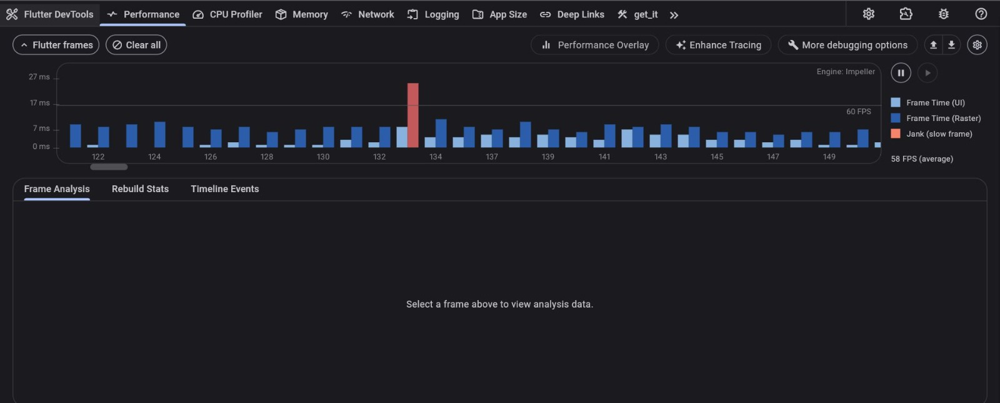
</p>

<p align="center">

  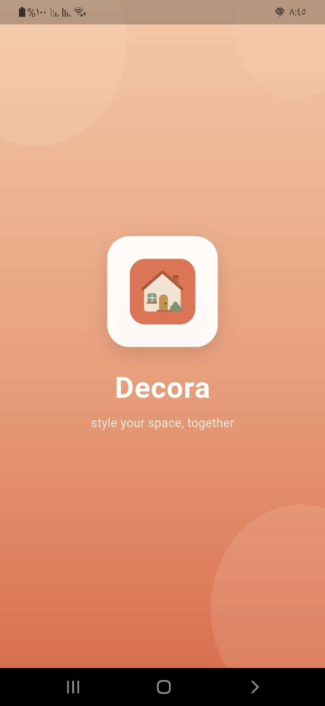
  
  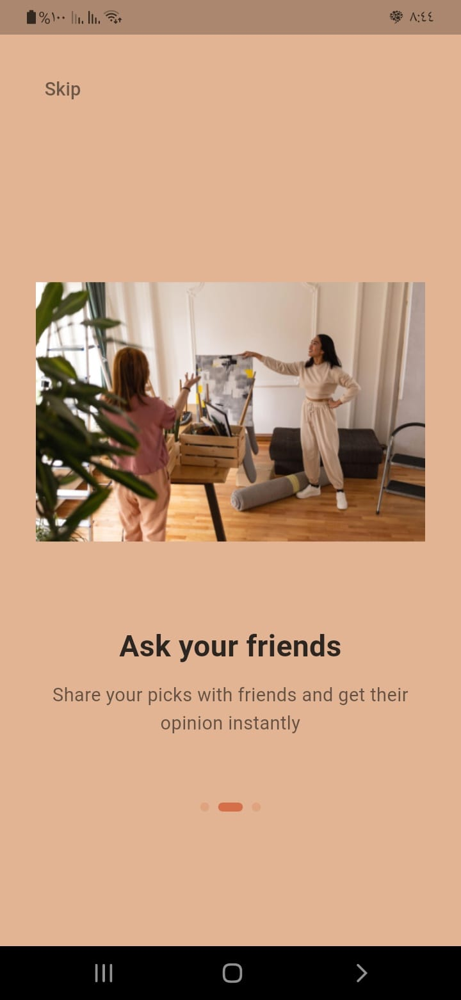
    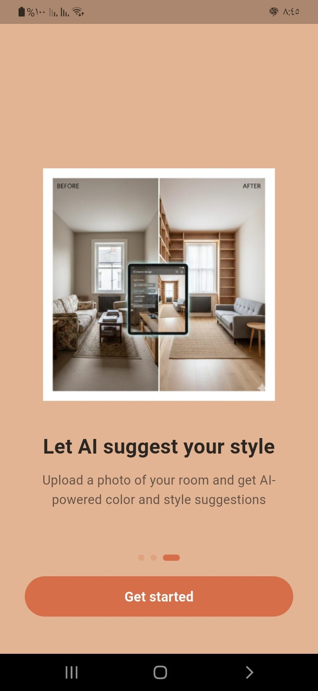

</p>
<p align="center">
  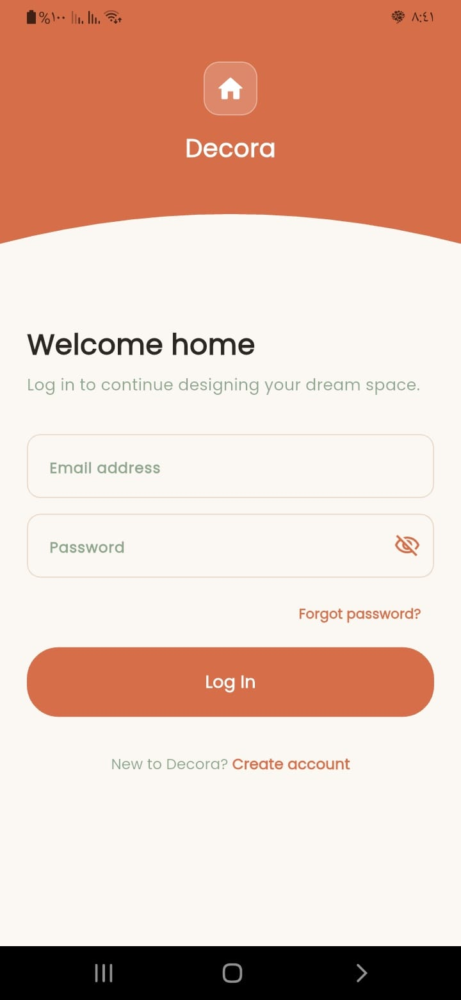
  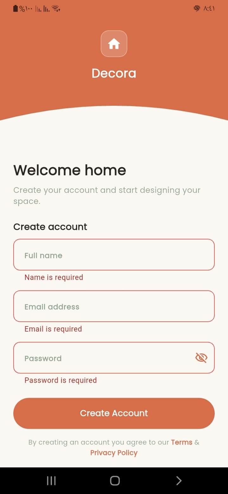
    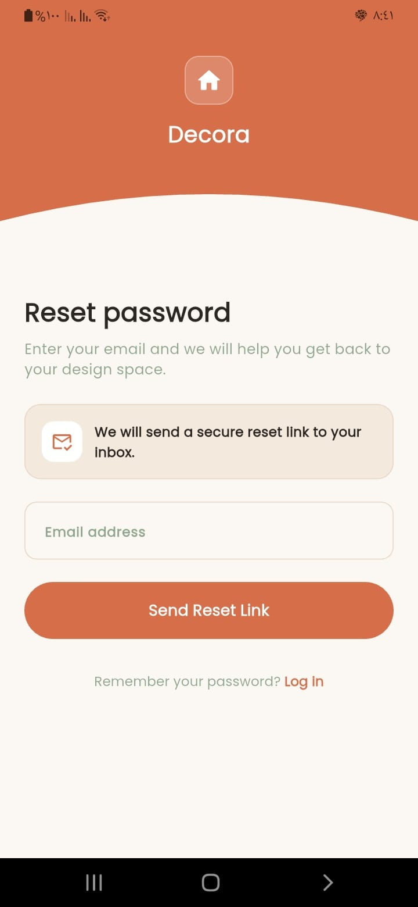
 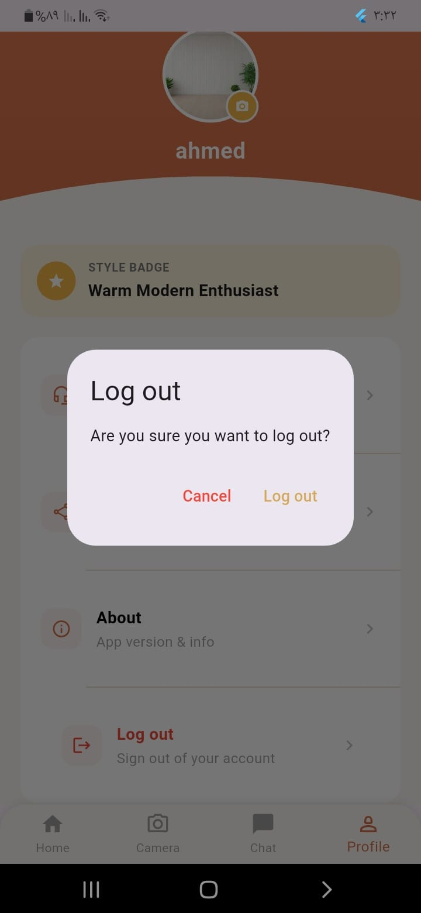

</p>
<p align="center">
  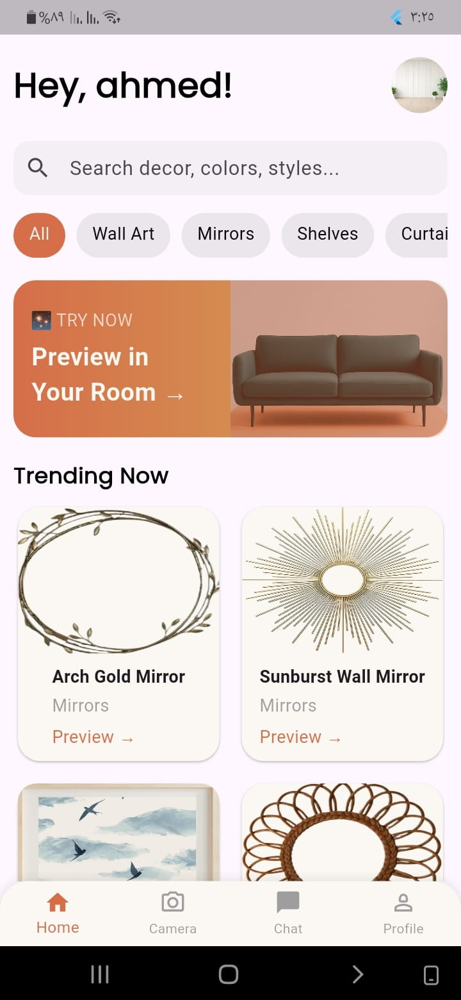
  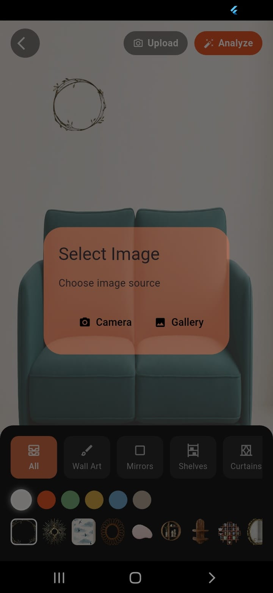
    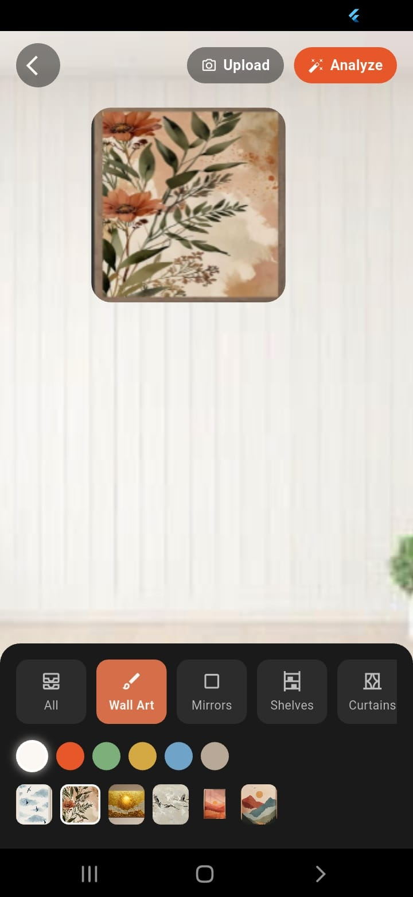
 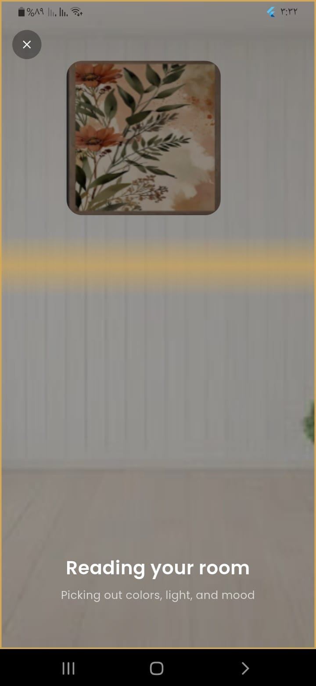
 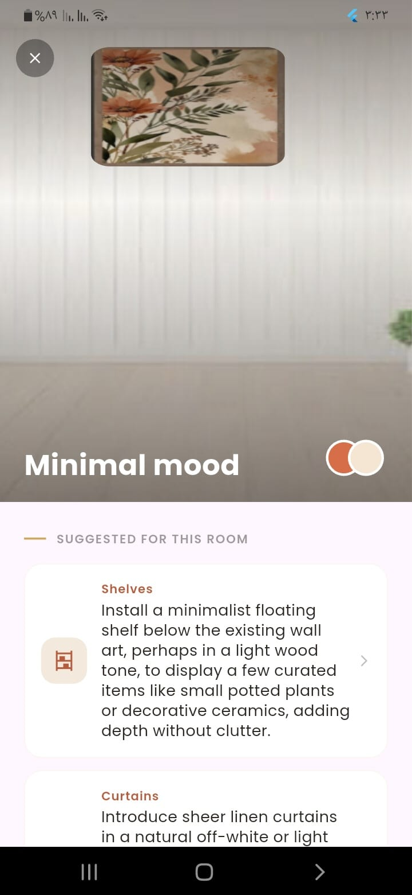

 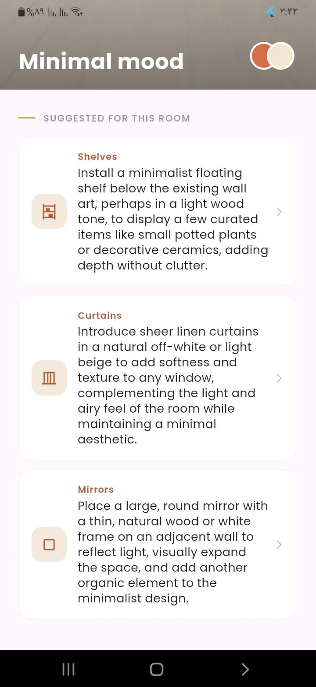

</p>

<p align="center">
  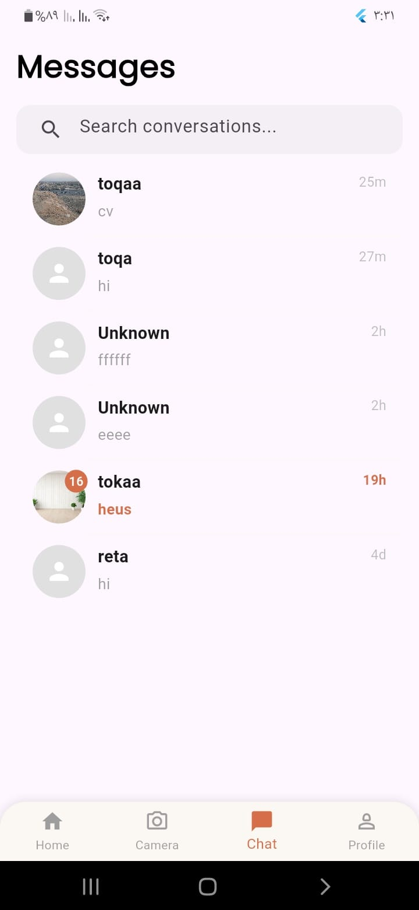
  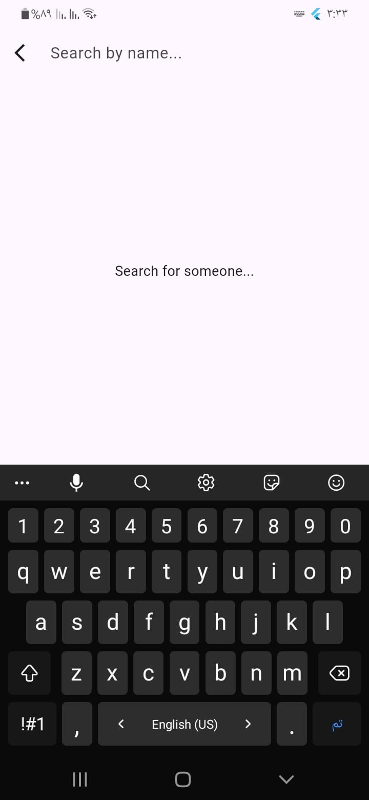
    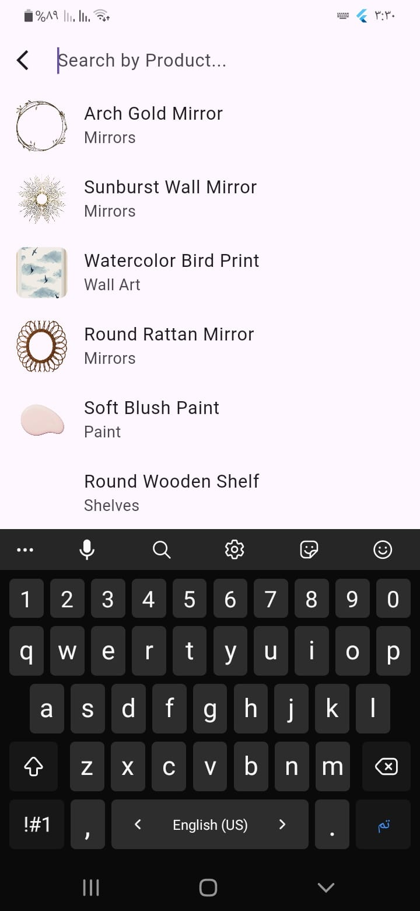
 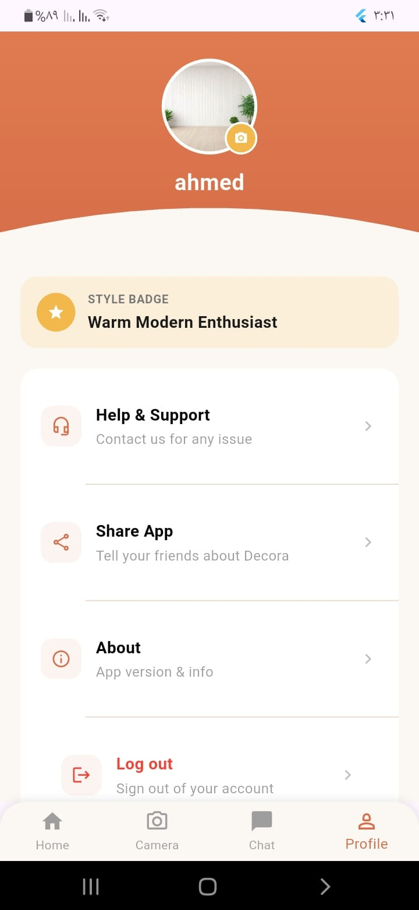
 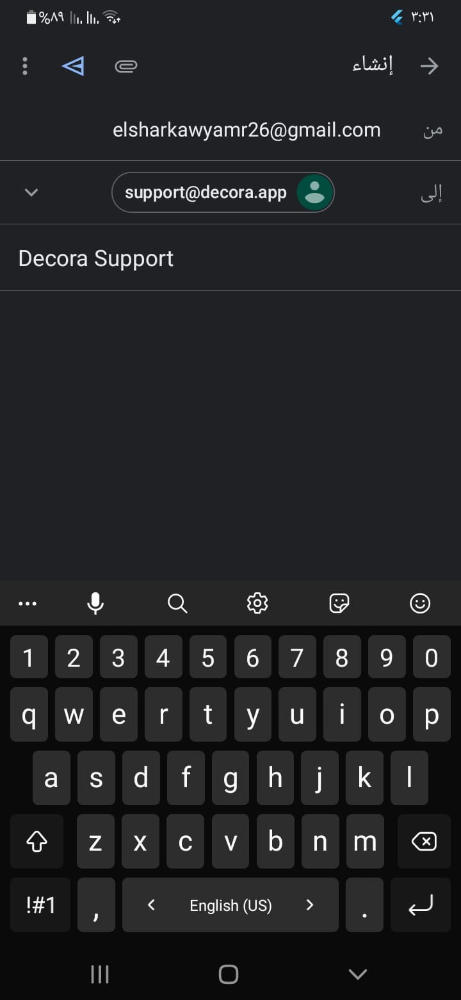

 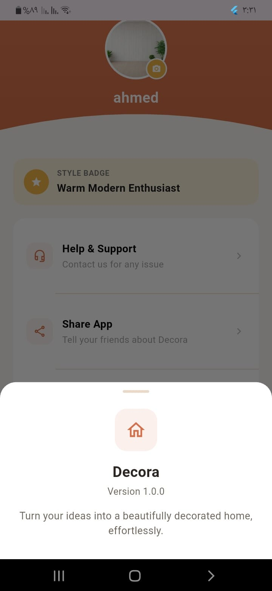

</p>


---

## 🧪 Testing the Room Analyzer Flow (for the Demo)
1. Go to the Room Analyzer tab and upload a photo of a room (or reuse one from Wall Preview).
2. The app extracts the dominant colors locally from the image.
3. The extracted palette + a short description are sent to the AI API.
4. The results screen displays: color palette, suggested style, and concrete decor suggestions.
5. Tap **"Try in Wall Preview"** to apply the suggestion on the same photo.

---

## 📌 Notes & Possible Improvements
- Improve dominant color extraction accuracy (e.g. clustering algorithms vs. simple averaging).
- Support more decor styles and finer-grained AI suggestions (furniture type, lighting fixtures, etc.).
- Deeper integration between Room Analyzer results and Wall Preview (auto-apply suggested palette).
- Allow sharing a Room Analyzer result directly inside Social Chat.
- Add unit and widget tests for Cubits and repositories.

---

## 👤 Author
Built as a personal/graduation project — **Decora Mobile Application (Flutter)**.

Made with ❤️ using Flutter